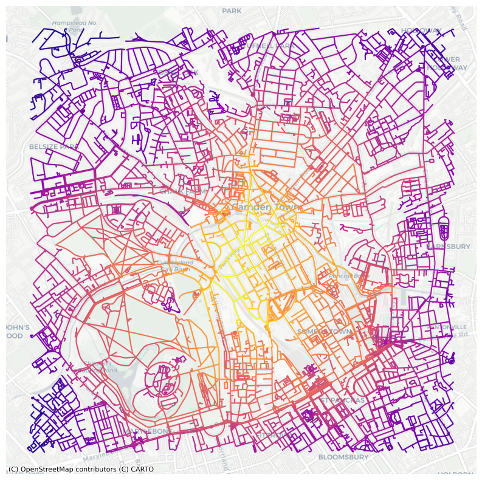

# GEOG0051 Mining Social and Geographic Datasets
## Formative Assesment: Street Network Analysis in Camden Town 

"Does Closeness Centrality, Betweeness Centrality and Tube Station affect location of retail store in Camden Town?"

Ade Febri Sandhini Putri (23189463)

Introduction
-------------------------------

Camden Town, London is a popular tourist area with a vibrant shopping scene, featuring major supermarket chains like Tesco, Sainsbury's, Aldi, Morrison's and M&S, as well as smaller convenience stores. This project aims to analyze the spatial distribution of these retail stores, investigating the relationship between street network centrality, tube locations, and their location in Camden Town. Additionally, the project aims to identify areas for potential new retail development based on pedestrian accessibility and maximizing footfall. 

Dataset Description
-------------------------------

The street network data of the study area was extracted from the Open Street Map database using the `OSMnx`library. The data was extracted within a radius of 2000 meters from the centroid of Camden Town, and it consisted of road network data with a walk type. The focus was prioritizing accessibility for pedestrians, such as tourists, who travel by public transportation like buses and tubes rather than private vehicles. This approach was taken because shopping areas with high foot traffic tend to attract more visitors and generate higher profits. 

Analysis and Visualization
-------------------------------


```python
# Import libraries
import numpy as np
import pandas as pd
import matplotlib
import matplotlib.pyplot as plt
import matplotlib.cm as cm
import matplotlib.colors as colors
import osmnx as ox
import networkx as nx
import contextily as ctx
```


```python
# Retrieve the street network graph based on the address 'Camden Town, London'
# Set the maximum distance to 2000 meters
# Specify the network type as 'walk' to prioritize walking paths
WG=ox.graph_from_address('Camden Town, London',dist=2000,network_type='walk')

# Create a directed graph representation from the retrieved graph
DG = ox.get_digraph(WG)
```


```python
# Calculate closeness centrality for edges in the walking network graph by converting it to a line graph
edge_cc = nx.closeness_centrality(nx.line_graph(DG))
```


```python
# Calculate betweenness centrality for edges in the walking network graph by converting it to a line graph
edge_bc = nx.betweenness_centrality(nx.line_graph(DG))
```


```python
# Assign closeness centrality values ('cc') as edge attributes to the walking network graph (DG)
nx.set_edge_attributes(DG, edge_cc,'cc')
```


```python
# Assign betweenness centrality ('bc') as edge attributes to the walking network graph (DG)
nx.set_edge_attributes(DG, edge_bc,'bc')
```


```python
# Create a multigraph (WG1) from the directed graph (DG)
WG1 = nx.MultiGraph(DG)
```

### Closeness Centrality


```python
# Visualise the closeness centrality 
nc = ox.plot.get_edge_colors_by_attr(WG1, 'cc', cmap='plasma')
fig, ax = ox.plot_graph(WG1, node_size=0, node_color='w', node_edgecolor='gray', node_zorder=2,
                        edge_color=nc, edge_linewidth=1.5, edge_alpha=1)
```


    

    


```python
# Visualise the closeness centrality by adding basemap
# convert graph to geopandas dataframe
gdf_edges = ox.graph_to_gdfs(WG1,nodes=False,fill_edge_geometry=True)

# set crs to 3857 (needed for contextily)
gdf_edges = gdf_edges.to_crs(epsg=3857) # setting crs to 3857

# plot edges according to degree centrality
ax=gdf_edges.plot('cc',cmap='plasma',figsize=(10,10))

# add a basemap using contextilly
ctx.add_basemap(ax,source=ctx.providers.CartoDB.Positron)
plt.axis('off')
plt.show()
```


    

    


According to the plot, streets that are well-connected to other streets and provide efficient access to various parts of Camden Town are located in the center, specifically __around Camden Town Station__, such as __Camden High Street__ and __Kentish Town Road__.

### Betweenness Centrality


```python
# Visualise the betweenness centrality 
nc = ox.plot.get_edge_colors_by_attr(WG1, 'bc', cmap='plasma')
fig, ax = ox.plot_graph(WG1, node_size=0, node_color='w', node_edgecolor='gray', node_zorder=2,
                        edge_color=nc, edge_linewidth=1.5, edge_alpha=1)
```


    

    


```python
# Visualise the betweenness centrality by adding basemap
# convert graph to geopandas dataframe
gdf_edges = ox.graph_to_gdfs(WG1,nodes=False,fill_edge_geometry=True)

# set crs to 3857 (needed for contextily)
gdf_edges = gdf_edges.to_crs(epsg=3857) # setting crs to 3857

# plot edges according to degree centrality
ax=gdf_edges.plot('bc',cmap='plasma',figsize=(10,10))

# add a basemap using contextilly
ctx.add_basemap(ax,source=ctx.providers.CartoDB.Positron)
plt.axis('off')
plt.show()
```


    

    


According to the plot, some roads with high betweenness centrality are likely to experience heavier traffic flow. These include __Camden Road, Albert Street, some parts of Delancey Street, and Park Village E Street__. 

### Landuse Data


```python
# Retrieve geometries of features near Camden Town, London, UK, based on specified tags
# Convert geometries to Web Mercator projection (EPSG:3857)
tags= tags={'amenity': True, 'highway':True, 'landuse':True, 'building':True, 'waterway': True, 'railway': True}
all_geom=ox.geometries.geometries_from_address('Camden Town, London, UK', tags, dist=2000)
all_geom = all_geom.to_crs(epsg=3857)
```

    C:\Users\LENOVO\AppData\Local\Temp\ipykernel_10508\3337972496.py:3: UserWarning: The `geometries` module and `geometries_from_X` functions have been renamed the `features` module and `features_from_X` functions. Use these instead. The `geometries` module and function names are deprecated and will be removed in a future release.
      all_geom=ox.geometries.geometries_from_address('Camden Town, London, UK', tags, dist=2000)
    


```python
#Symbolise all building based on category
fig,ax = plt.subplots(figsize=(10,10))
all_geom[all_geom['building'].notna()].plot('building',
                                            ax=ax,
                                            categorical=True,
                                            legend=True)

ctx.add_basemap(ax,source=ctx.providers.CartoDB.Positron)
plt.axis('off')
plt.show()
```


    

    


### Combine closeness and betweenness centrality with retail building data for visualization


```python
# Combine closeness centrality with retail building data 

# Visualize the closeness centrality by adding a basemap
# Convert the graph to a GeoPandas dataframe
gdf_edges = ox.graph_to_gdfs(WG1, nodes=False, fill_edge_geometry=True)

# Set the coordinate reference system (CRS) to EPSG:3857 (needed for contextily)
gdf_edges = gdf_edges.to_crs(epsg=3857)

# Plot edges according to closeness centrality
ax = gdf_edges.plot('cc', cmap='plasma', figsize=(10, 10))

# Symbolize all retail buildings
all_geom[all_geom['building'] == 'retail'].plot(ax=ax, color='red')

# Add a basemap using contextily
ctx.add_basemap(ax, source=ctx.providers.CartoDB.Positron)
plt.axis('off')
plt.show()
```


    

    


Based on the plot, retail stores tend to cluster along streets with high closeness centrality such as Camden Rd and Parkway because these streets typically experience higher pedestrian traffic and better accessibility, which are favorable conditions for retail businesses.


```python
# Combine betweenness centrality with retail building data 

# Visualize the betweenness centrality by adding a basemap
# Convert the graph to a GeoPandas dataframe
gdf_edges = ox.graph_to_gdfs(WG1, nodes=False, fill_edge_geometry=True)

# Set the coordinate reference system (CRS) to EPSG:3857 (needed for contextily)
gdf_edges = gdf_edges.to_crs(epsg=3857)

# Plot edges according to betweenness centrality
ax = gdf_edges.plot('bc', cmap='plasma', figsize=(10, 10))

# Symbolize all retail buildings
all_geom[all_geom['building'] == 'retail'].plot(ax=ax, color='red')

# Add a basemap using contextily
ctx.add_basemap(ax, source=ctx.providers.CartoDB.Positron)
plt.axis('off')
plt.show()
```


    

    


Interestingly, the placement of retail stores doesn't always located on streets with high betweenness centrality. While these streets may experience a greater flow of traffic, retailers often take into account a variety of other factors before settling on a location. These factors may include competition, accessibility, visibility, and the unique dynamics of the local market. 

### Combine retail and tube station data for visualization


```python
# Create a new figure and axis
fig, ax = plt.subplots(figsize=(10, 10))

# Plot train stations in black
all_geom[all_geom['building'] == 'train_station'].plot(ax=ax, color='black')

# Plot retail buildings in red
all_geom[all_geom['building'] == 'retail'].plot(ax=ax, color='red')

# Add basemap using contextily
ctx.add_basemap(ax, source=ctx.providers.CartoDB.Positron)

# Turn off axis
plt.axis('off')

# Show the plot
plt.show()
```


    

    


Based on the plot, tube locations affect the location of retail stores, as seen with Camden Town Station, Kentish Town Station, and Euston. However, this influence varies with other tube stations.

### Potential areas for new retail development

According to the previous plots, the most potential area for new retail development would likely be near tube stations with high closeness centrality, as these two pieces of information show a significant effect to the retail pattern in Camden Town. These areas have high connectivity and accessibility, making them attractive locations for retail establishments. 
